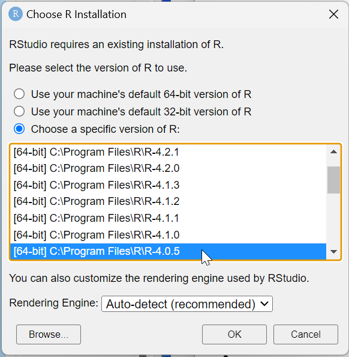
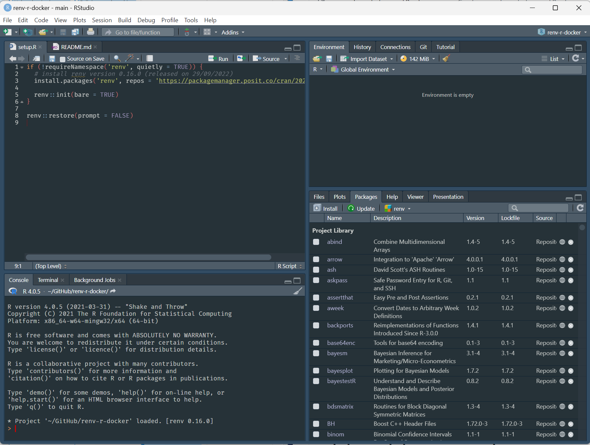
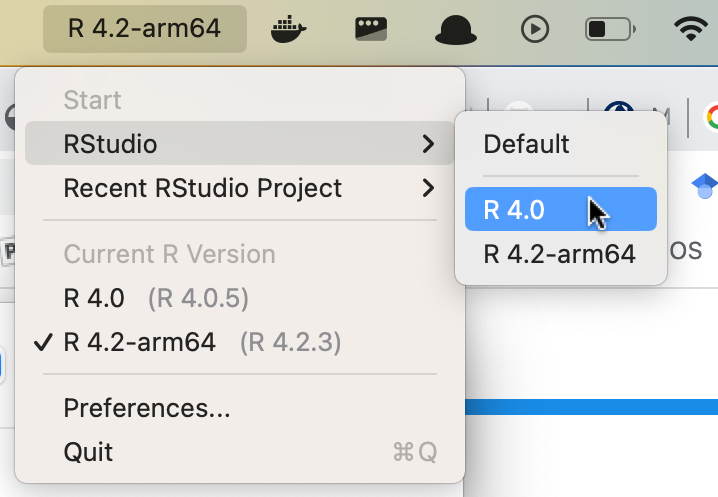

# r-docker-renv

This repo recreates the r-docker environment on your local installation of R.

Only the package versions and version of R will be the same. The operating system and architecture may be different, hence you may see some very small differences in results.

## Setup on Windows

* Install R 4.0.5 for Windows <https://cran.r-project.org/bin/windows/base/old/4.0.5/R-4.0.5-win.exe>
* Open RStudio using R 4.0.5 by holding Ctrl when you clicking the RStudio icon. This will show you the RStudio R version selection window
  
* Open this project in that RStudio running R 4.0.5, by clicking File | Open Project...
* Run *setup.R* or more simply run in R
  ```r
  renv::restore(prompt = FALSE)
  ```
* Here's proof that this ran successfully on Windows
  
* A warning you can ignore: After successfully running the restore if you run `renv::status()` it will report the following.
  ``` r
  renv::status()
  #> The following package(s) do not appear to be used in this project:
  #>                       _
  #> BH                      [1.72.0-3]
  #>... (alot of output deleted here) 
  #> zoo                     [1.8-8]
  #> 
  #> Use `renv::snapshot()` to remove them from the lockfile.
  ```
  You can ignore the advice to remove them because all this means is that there is no *.R*/*.Rmd*/*.qmd* script/s in the project that uses the all the packages.
* You can then change the working directory to that of your OS project using `setwd()`, and use File | Open File... to open R scripts etc.

## Setup on macOS (Intel processor only)

* macOS users should install Xcode developer tools by issuing in the Terminal
  ```
  xcode-select --install
  ```
* Install R 4.0.5 using the relevant installer or use `rig`
* Installer for macOS
  * Intel processor <https://cran.r-project.org/bin/macosx/base/R-4.0.5.pkg>
  * Apple processor - I don't think R 4.0.5 was released for Apple Silicon, so run the Intel version above (it will automatically run under rosetta2)
* rig <https://github.com/r-lib/rig#readme>, first install [Homebrew](https://brew.sh/), then install `rig`
  ```
  brew tap r-lib/rig
  brew install --cask rig
  ```
  * (Only works on Windows and Intel Macs) Install R 4.0.5
    ```
    rig add 4.0.5
    ```
* On macOS launch the Rig.app menu bar app which will now be in your Applications directory
* On Apple Silicon Macs run
  ```
  rig system make-orthogonal
  ```
* Use the Rig.app menu bar app to launch RStudio under R 4.0.5 as follows

  
* Open this project
* Run *setup.R* or more simply run in R
  ```r
  renv::restore(prompt = FALSE)
  ```
