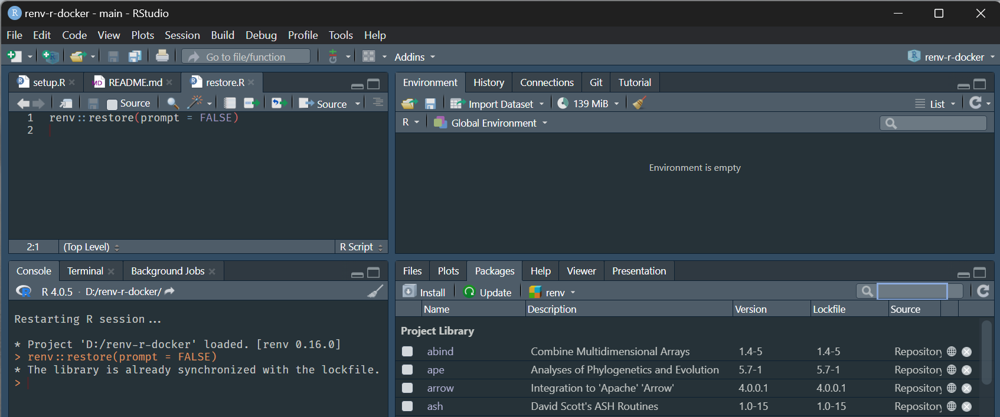

# r-docker-renv
 
This repo recreates the r-docker environment on your local installation of R.

Only the package versions and version of R will be the same. The operating system and architecture may be different, hence you may see some very small differences in results.

## Setup

* macOS users should install Xcode developer tools by issuing in the Terminal
  ```
  xcode-select --install
  ```
* Install R 4.0.5 using the relevant installer or use `rig`
* Installer for Windows <https://cran.r-project.org/bin/windows/base/old/4.0.5/R-4.0.5-win.exe>
* Installer for macOS
  * Intel processor <https://cran.r-project.org/bin/macosx/base/R-4.0.5.pkg>
  * Apple processor - I don't think R 4.0.5 was released for Apple Silicon, so run the Intel version above (it will automatically run under rosetta2)
* rig <https://github.com/r-lib/rig#readme>, first install [Homebrew](https://brew.sh/)
  ```
  brew tap r-lib/rig
  brew install --cask rig
  ```
  * (Only works on Windows and Intel Macs) Install R 4.0.5
    ```
    rig add 4.0.5
    ```

* On macOS launch the Rig.app menu bar app which will now be in your Applications directory
* On Apple Silicon Macs run
  ```
  rig system make-orthogonal
  ```
  * Use the Rig.app menu bar app to launch RStudio under R 4.0.5 as follows

    
  * Open this project
  * On Windows hold Ctrl when clicking the RStudio icon to obtain the R version selection
    

* Run *setup.R* or more simply run in R
  ```r
  renv::restore(prompt = FALSE)
  ```
* Here's proof that this ran successfully on Windows
  
